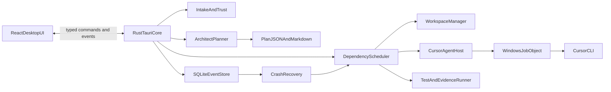

# Architecture

Tiamat is a Tauri 2 desktop app: React/TypeScript UI + Rust/Tokio core + SQLite WAL store.

## Rust modules (`src-tauri/src`)

| Module | Responsibility |
|---|---|
| `app` | Tauri setup, commands, global shortcut, lifecycle |
| `db` | Migrations, repositories, event transaction/outbox |
| `intake` | Path canonicalization, inventory, project detection, trust |
| `workspace` | Snapshots, clones/copies, checkpoints, promotion |
| `cursor` | Executable resolution, capabilities, command builder, stream parser |
| `process` | Job Objects, registry, watchdog, cancellation |
| `planner` | Architect prompt, plan parser, repair, Markdown render |
| `scheduler` | DAG, locks, queues, retries, model routing |
| `executor` | Phase execution orchestration |
| `verification` | Test discovery, command policy, evidence |
| `security` | Redaction, policy, limits, audit |
| `recovery` | Startup reconciliation and continuation |
| `packaging` | Install/upgrade/uninstall policy, cleanup proof helpers |

Shared contracts live in `crates/tiamat-contracts`.

## Frontend (`src`)

Feature panels under `src/features/*`, domain types under `src/domain`, Tauri bridge under `src/lib/tauri`.

## Data ownership

- SQLite is authoritative for run state, events, attempts, recovery.
- Each run has one `.tiamat/plan.json` and one rendered `.tiamat/MASTER-PLAN.md`.
- Agents submit immutable phase-result payloads; only the orchestrator updates SQLite and plan projections.
- Git commits are authoritative content checkpoints.
- Graph positions are UI metadata only.

Canonical product decisions: root [`MASTER-PLAN.md`](../../MASTER-PLAN.md).
